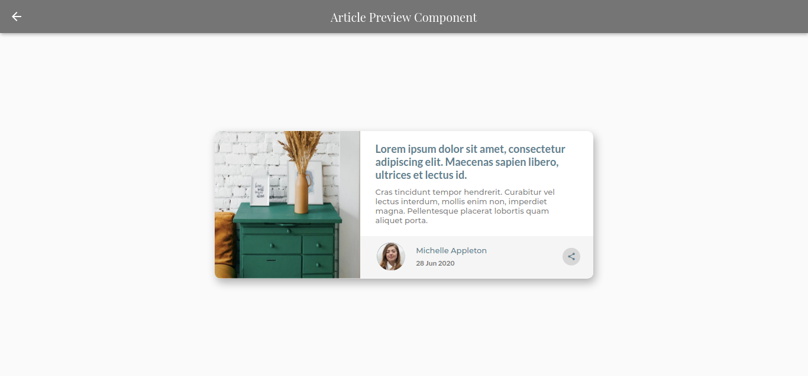
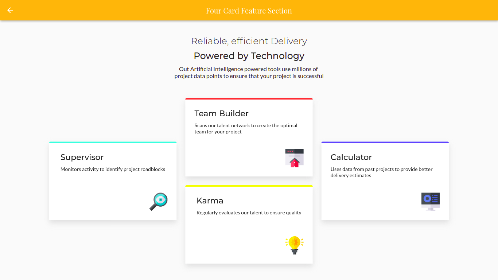
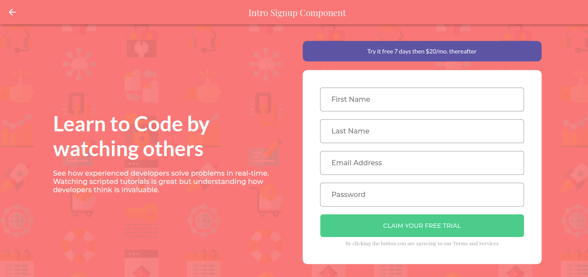
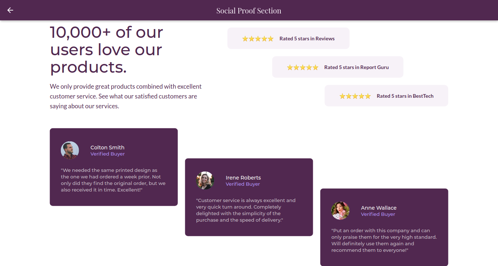

# flutter-ui

&nbsp;
&nbsp;
&nbsp;

A Flutter project for implementing various responsive UI's in flutter for web, desktop and mobile.

## Getting started

+ Download or clone the repo.
+ Run on mobile or web or linux.

### Available UI's

    
Article Preview Component

    

    
Price Grid Component

    

    
Four Card Feature Section

    

    
Intro Signup Component

    

    
Social Proof Section

    

 

#### UI Designs from [Frontend Mentor](https://www.frontendmentor.io/)
